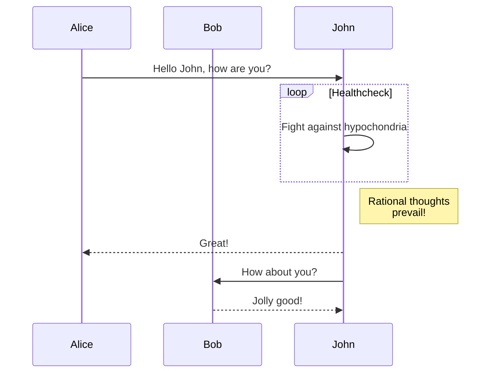
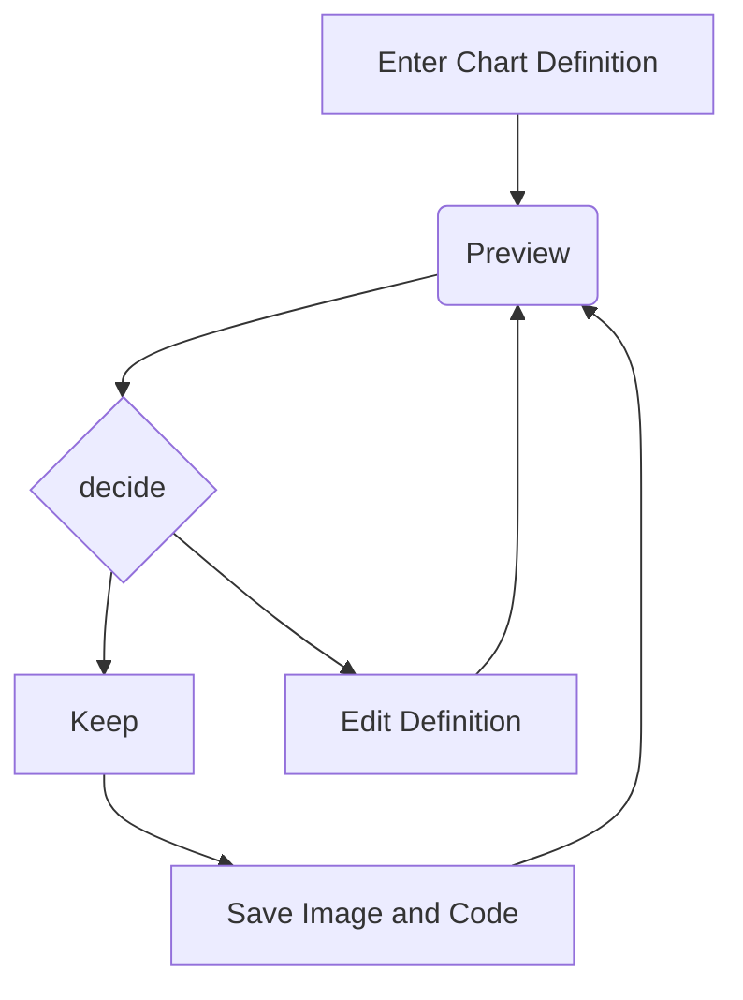

# GitHub Experiment

1. [Learned commands](#learned-commands)
1. [Newly learned commands](#newly-learned-commands)


```geojson
{
  "type": "FeatureCollection",
  "features": [
    {
      "type": "Feature",
      "id": 1,
      "properties": {
        "ID": 0
      },
      "geometry": {
        "type": "Polygon",
        "coordinates": [
          [
              [-90,35],
              [-90,30],
              [-85,30],
              [-85,35],
              [-90,35]
          ]
        ]
      }
    }
  ]
}
```
| Column 1 Header | Column 2 Header | Column 3 Header |
| --------------- | --------------- | --------------- |
| Row 1 Column 1 | Row 1 Column 2 | Row 1 Column 3 |
| Row 2 Column 1 | Row 2 Column 2 | Row 2 Column 3 |
| Row 3 Column 1 | Row 3 Column 2 | Row 3 Column 3 |




```stl
solid cube_corner
  facet normal 0.0 -1.0 0.0
    outer loop
      vertex 0.0 0.0 0.0
      vertex 1.0 0.0 0.0
      vertex 0.0 0.0 1.0
    endloop
  endfacet
  facet normal 0.0 0.0 -1.0
    outer loop
      vertex 0.0 0.0 0.0
      vertex 0.0 1.0 0.0
      vertex 1.0 0.0 0.0
    endloop
  endfacet
  facet normal -1.0 0.0 0.0
    outer loop
      vertex 0.0 0.0 0.0
      vertex 0.0 0.0 1.0
      vertex 0.0 1.0 0.0
    endloop
  endfacet
  facet normal 0.577 0.577 0.577
    outer loop
      vertex 1.0 0.0 0.0
      vertex 0.0 1.0 0.0
      vertex 0.0 0.0 1.0
    endloop
  endfacet
endsolid
```




<html lang="en">
  <head>
    <meta charset="utf-8" />
  </head>
  <body>
    <pre class="mermaid">
            graph LR 
            A --- B 
            B-->C[fa:fa-ban forbidden] 
            B-->D(fa:fa-spinner);
    </pre>
    <pre class="mermaid">
            graph TD 
            A[Client] --> B[Load Balancer] 
            B --> C[Server1] 
            B --> D[Server2]
    </pre>
    <script type="module">
      import mermaid from 'The/Path/In/Your/Package/mermaid.esm.mjs';
      mermaid.initialize({ startOnLoad: true });
    </script>
  </body>
</html>
