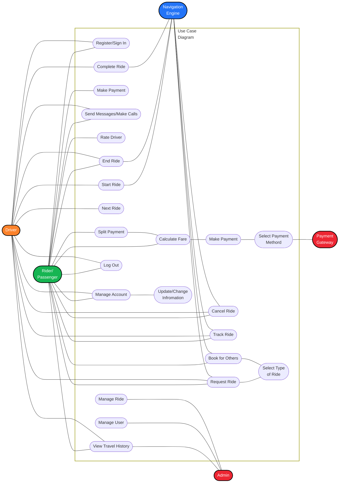
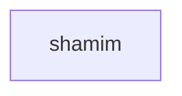

```mermaid
    graph LR;
    A([Rider/\nPassenger]):::green;
    B([Driver]):::orange;
    C([Navigation\nEngine]):::blue;
    D([Admin]):::red;
    E([Payment\nGateway]):::red;
    A --- 1([Register/Sign In])
    B ---- 1
    A --- 2([Manage Account])---2.1([Update/Change\nInfromation])
    B ---- 2
    A --- 3([Request Ride])---3.1([Select Type\nof Ride])
    B ---- 3
    C --- 3
    A --- 4([Cancel Ride])
    B ---- 4
    C --- 4
    A --- 5([Track Ride])
    B ---- 5
    C---5
    A --- 6([Make Payment])
    A --- 7([Send Messages/Make Calls])
    B ---- 7
    A --- 8([Rate Driver])
    A --- 9([View Travel History])
    9 ---- D
    B ---- 9
    A --- 10([Calculate Fare])---11([Make Payment])---12([Select Payment\nMethord])
    12 --- E
    A --- 13([Split Payment])---10
    B --- 14([Next Ride])
    A --- 15([Book for Others]) ---3.1
    C --- 15
    B ---- 16([Start Ride])
    16 --- C
    A --- 17([End Ride])
    B ---- 17
    17 --- C
    A --- 18([Log Out])
    B ---- 18
    B --- 19([Complete Ride])
    19 --- C
    20([Manage User])----D
    21([Manage Ride])----D
    %%A --> 16([ ])
    classDef blue fill:#2374f7,stroke:#000,stroke-width:2px,color:#fff;
    classDef orange fill:#fc822b,stroke:#000,stroke-width:2px,color:#fff;
    classDef green fill:#16b552,stroke:#000,stroke-width:2px,color:#fff;
    classDef red fill:#ed2633,stroke:#000,stroke-width:2px,color:#fff;
    classDef none fill:#none,stroke:#000,stroke-width:2px,color:#fff;
    subgraph USE[Use Case\nDiagram];
    style USE  fill:none,stroke:#f0000,stroke-width:2px;
    1;2;2.1;3;3.1;4;5;6;7;8;9;10;11;12;13;14;15;16;17;18;19;20;21
    end

```

```mermaid
    graph LR
    shamim
```

```mermaid
    graph LR
    shamim
```

```mermaid
    graph LR
    shamim
```

```mermaid
    graph LR
    shamim
```
