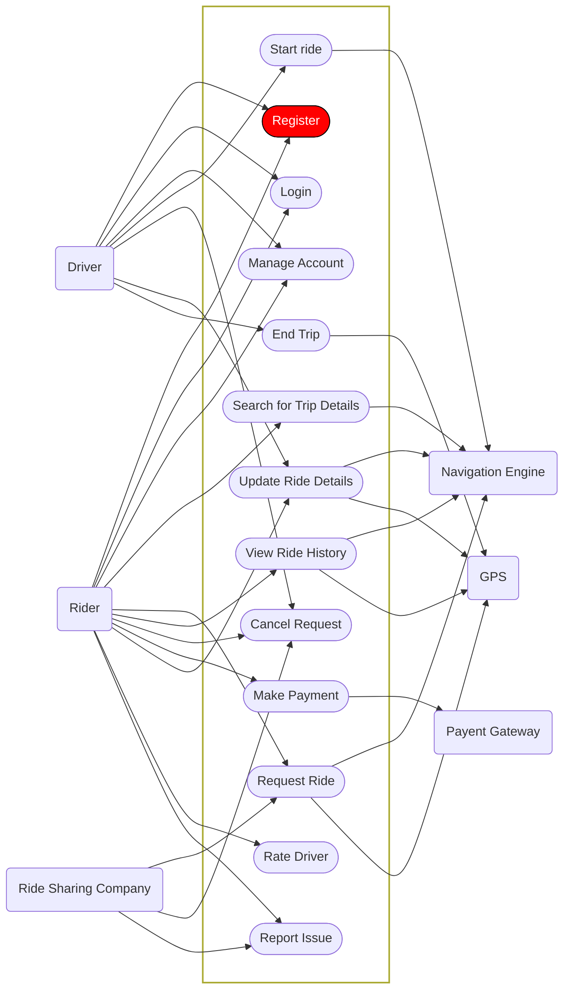
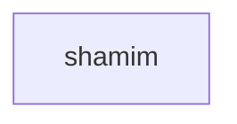

```mermaid
    graph LR
    A((Rider/Passenger))
    B((Driver))
    A --> 1([Register/Sign In])
    B --> 2([Book Taxi])
    A --> 3([Calculate Fare])
    A --> 4([Track Ride])
    A --> 5([Make Payment])
    A --> 6([Send Messages/Make Calls])
    A --> 7([Rate Driver])
    A --> 8([View Travel History])
    A --> 9([Cancel Ride])
    A --> 10([Split Payment])
    A --> 11([Schedule for Later])
    A --> 12([Book for Others])
    A --> 13([ ])
    A --> 14([ ])
    A --> 15([ ])

    subgraph
    1;2;3;4;5;6;7;8;9;10;11;12;134
    end

```



Driver Interface:
Manage Driver Profile and Status
Receive Ride Requests
Navigate using Google Maps
Receive Notifications and Alerts
View Trip Reports and Earnings
Track Waiting Time
Prepare for Next Ride

```


```

Rider/Passenger Interface:
Register/Sign In
Book Taxi
Calculate Fare
Track Ride
Make Payment
Send Messages/Make Calls
Rate Driver
View Travel History
Cancel Ride
Split Payment
Schedule for Later
Book for Others

Driver Interface:
Manage Driver Profile and Status
Receive Ride Requests
Navigate using Google Maps
Receive Notifications and Alerts
View Trip Reports and Earnings
Track Waiting Time
Prepare for Next Ride




