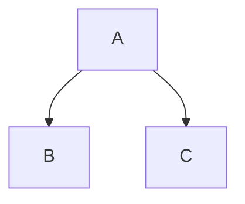
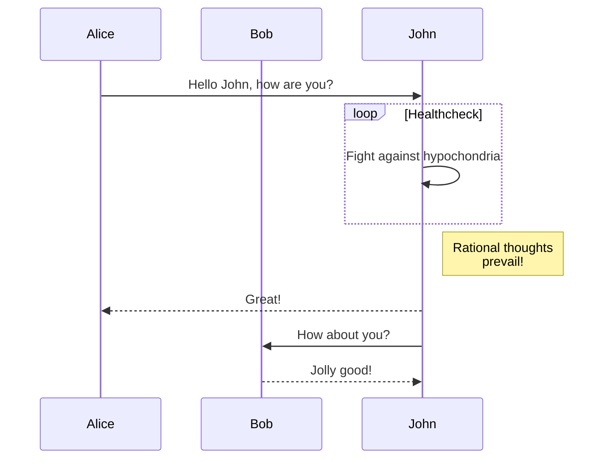
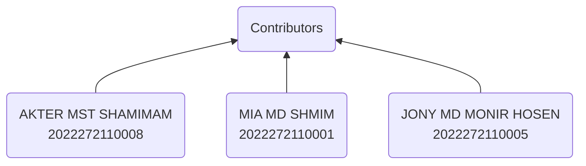
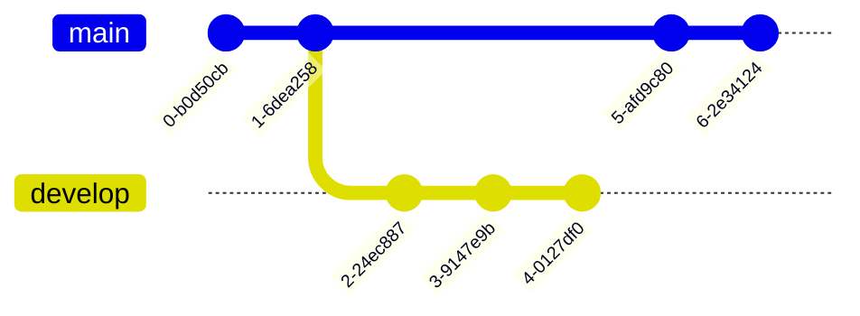

# GitHub Experiment

1. [Learned commands](#learned-commands)
1. [Newly learned commands](#newly-learned-commands)




# use case diagram

```mermaid
  graph TD
      User-->Login
      User-->Logout
      User-->View Profile
      User-->Search
      Admin-->Login
      Admin-->Logout
      Admin-->Create User
      Admin-->Edit User

```

```mermaid
graph TD
    User-->Login
    User-->View Profile
    User-->Logout
    Login-->Dashboard
    View Profile-->Dashboard
    Dashboard-->View Reports
    Dashboard-->Create Report
    Dashboard-->Edit Profile
    Dashboard-->Logout
```

```geojson
{
  "type": "FeatureCollection",
  "features": [
    {
      "type": "Feature",
      "id": 1,
      "properties": {
        "ID": 0
      },
      "geometry": {
        "type": "Polygon",
        "coordinates": [
          [
            [
              -90,
              35
            ],
            [
              -90,
              30
            ],
            [
              -85,
              30
            ],
            [
              -85,
              35
            ],
            [
              -90,
              35
            ]
          ]
        ]
      }
    }
  ]
}
```

| Column 1 Header | Column 2 Header | Column 3 Header |
| --------------- | --------------- | --------------- |
| Row 1 Column 1  | Row 1 Column 2  | Row 1 Column 3  |
| Row 2 Column 1  | Row 2 Column 2  | Row 2 Column 3  |
| Row 3 Column 1  | Row 3 Column 2  | Row 3 Column 3  |



```stl
solid cube_corner
  facet normal 0.0 -1.0 0.0
    outer loop
      vertex 0.0 0.0 0.0
      vertex 1.0 0.0 0.0
      vertex 0.0 0.0 1.0
    endloop
  endfacet
  facet normal 0.0 0.0 -1.0
    outer loop
      vertex 0.0 0.0 0.0
      vertex 0.0 1.0 0.0
      vertex 1.0 0.0 0.0
    endloop
  endfacet
  facet normal -1.0 0.0 0.0
    outer loop
      vertex 0.0 0.0 0.0
      vertex 0.0 0.0 1.0
      vertex 0.0 1.0 0.0
    endloop
  endfacet
  facet normal 0.577 0.577 0.577
    outer loop
      vertex 1.0 0.0 0.0
      vertex 0.0 1.0 0.0
      vertex 0.0 0.0 1.0
    endloop
  endfacet
endsolid
```




