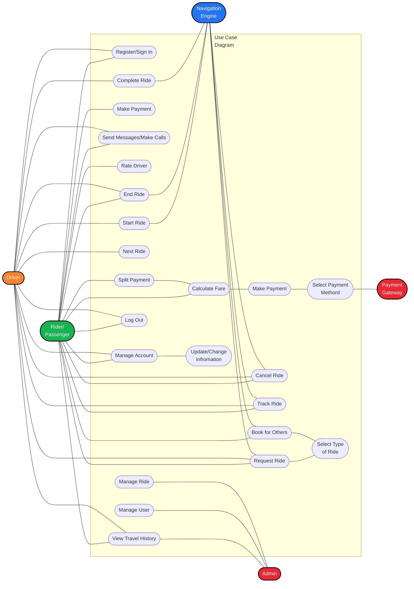
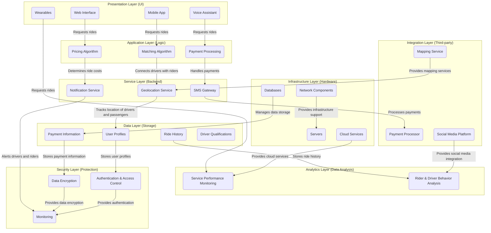
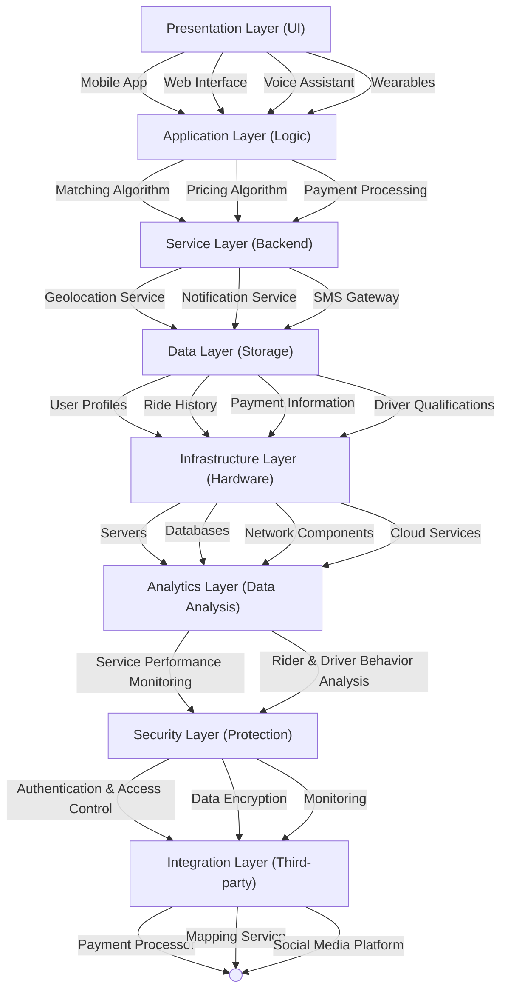
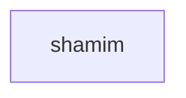
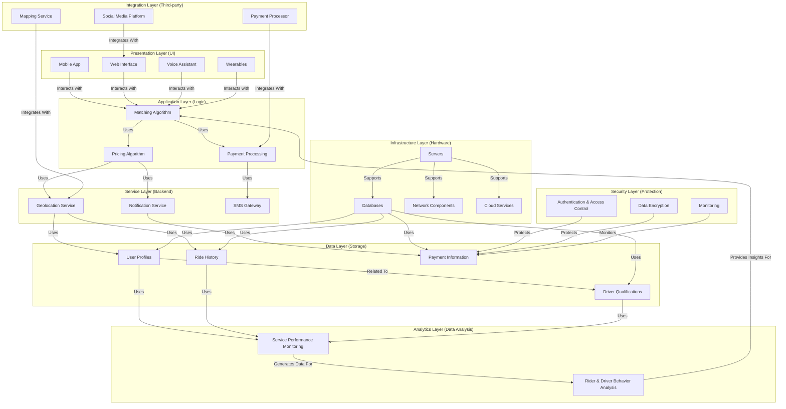

```mermaid
graph LR
A[Customer and Driver Details Management (CRM)]
B[Booking Management]
C[Vehicle Detail Management (if self-owned)]
D[Location and Fares Management]
E[Call System Management]
F[Communication]
G[Ratings and Reviews]
H[Promotions and Discounts]
I[Payroll Management]
J[Content Management]
K[Customer Support and Help]

A -->|Manage| B
A -->|Manage| C
D -->|Manage| B
E -->|Manage| B
F -->|Communicate with<br>users
G -->|Manage| B
H -->|Create and Manage<br>Promotional offers
I -->|Manage| C
J -->|Manage content<br>on website or app
K -->|Provide Customer<br>support and help

```
